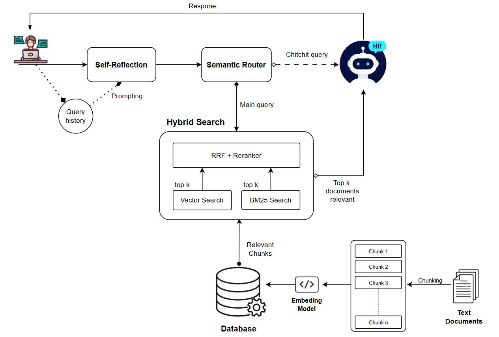

# HybridRAG Backend

[](#prerequisites)
[](#api-surface)
[](#run-with-docker-compose)
[](#run-with-docker-compose)
[](#run-with-docker-compose)

Production-ready backend for a Hybrid RAG chatbot with Google sign-in, hybrid retrieval (Vector + BM25 + RRF + reranker), async ingestion, and chat session history.

## Table of Contents

- [Highlights](#highlights)
- [Architecture](#architecture)
- [Project Structure](#project-structure)
- [Prerequisites](#prerequisites)
- [Quick Start](#quick-start)
- [Run with Docker Compose](#run-with-docker-compose)
- [Run API Server](#run-api-server)
- [Configuration](#configuration)
- [Authentication Flow](#authentication-flow)
- [API Surface](#api-surface)
- [Operational Notes](#operational-notes)
- [Troubleshooting](#troubleshooting)
- [Production Checklist](#production-checklist)

## Highlights

- Google login API with internal access/refresh token lifecycle.
- User-scoped chat history (`sessions` + `messages`) with ownership checks.
- Search APIs locked to server-side settings (no client override for top-k/rerank timeout knobs).
- Full `chat/answer` pipeline and SSE streaming endpoint.
- File ingestion via MinIO + Kafka event flow.
- Health endpoints for live/readiness checks.

## Architecture

<p align="center">
  
</p>

**Core flow**
1. User question enters `Self-Reflection`.
2. Semantic router decides `chitchat` vs `retrieval` path.
3. Retrieval path executes hybrid search: vector + BM25 -> RRF -> optional reranker.
4. Top relevant chunks are used to generate final answer.
5. User and assistant messages are persisted per session.
6. Ingestion pipeline keeps BM25/FAISS stores up to date from MinIO events.

## Project Structure

```text
backend/
  build/
    kafka/                 # Kafka + Zookeeper compose
    minio/                 # MinIO compose + event setup
    postgres/              # Postgres compose + init schema
  data/
    vector_store/          # BM25 and FAISS local caches
  scripts/
  src/
    api/
      app.py               # FastAPI app entrypoint
      routers/             # auth, users, search, chat, files, health
    config/
      settings.py          # runtime config from .env
    hybridrag/
      retrieval/           # BM25, vector, fusion, reranker
      rewriter/            # self-reflection / query rewrite
      router/              # keyword/semantic routing
      ingestion/
        ingestion_service/ # Kafka consumer and indexing
```

## Prerequisites

- Python `>= 3.10` (recommended `3.11`)
- Docker Engine + Docker Compose plugin
- OpenAI API key
- Google OAuth Client ID

## Quick Start

Run all commands from `backend/`.

### 1) Setup Python environment

```powershell
python -m venv .venv
.\.venv\Scripts\Activate.ps1
pip install -r requirements.txt
```

### 2) Configure environment

```powershell
Copy-Item .env.example .env
```

Update required fields in `.env`:

- `OPENAI_API_KEY`
- `GOOGLE_CLIENT_ID`
- `POSTGRES_USER`
- `POSTGRES_PASSWORD`
- `POSTGRES_DB`
- `MINIO_ROOT_USER`
- `MINIO_ROOT_PASSWORD`
- `MINIO_ACCESS_KEY`
- `MINIO_SECRET_KEY`
- `MINIO_BUCKET_NAME`
- `KAFKA_BOOTSTRAP_SERVERS` (local default: `localhost:9092`)

## Run with Docker Compose

Create shared network once:

```powershell
docker network create utehy-network 2>$null
```

Start infrastructure and ingestion service:

```powershell
docker compose --env-file .env -f build/kafka/docker-compose.yml up -d
docker compose --env-file .env -f build/postgres/docker-compose.yml up -d
docker compose --env-file .env -f build/minio/docker-compose.yml up -d
docker compose --env-file .env -f src/hybridrag/ingestion/ingestion_service/docker-compose.yml up -d --build
```

Optional checks:

```powershell
docker ps
```

## Run API Server

Development mode:

```powershell
python -m uvicorn src.api.app:app --host 0.0.0.0 --port 8000 --reload --reload-dir src
```

Production-like local mode:

```powershell
python -m uvicorn src.api.app:app --host 0.0.0.0 --port 8000
```

Endpoints:

- Swagger UI: `http://localhost:8000/docs`
- Liveness: `http://localhost:8000/api/v1/health/live`
- Readiness: `http://localhost:8000/api/v1/health/ready`
- MinIO Console: `http://localhost:9001`

## Configuration

Main config lives in `src/config/settings.py` and reads `.env`.

Important runtime knobs:

- Retrieval: `VECTOR_SEARCH_K`, `ELASTIC_SEARCH_K`, `FUSION_K`, `RRF_K`, `USE_RERANKER`, `RERANK_TOP_K`
- Auth: `AUTH_ACCESS_TOKEN_TTL_MINUTES`, `AUTH_REFRESH_TOKEN_TTL_DAYS`, `GOOGLE_REQUIRE_VERIFIED_EMAIL`, `GOOGLE_ALLOWED_HD`
- Storage: `MINIO_*`
- Eventing: `KAFKA_BOOTSTRAP_SERVERS`, `INDEXING_INPUT_TOPIC`, `INDEXING_STATUS_TOPIC`
- Index state table: `INDEX_STATE_SCHEMA`, `INDEX_STATE_TABLE`

## Authentication Flow

1. Frontend obtains Google `id_token`.
2. Exchange Google token:

```bash
curl -X POST "http://localhost:8000/api/v1/auth/google" \
  -H "Content-Type: application/json" \
  -d "{\"id_token\":\"<GOOGLE_ID_TOKEN>\"}"
```

3. Use returned access token:

```bash
curl "http://localhost:8000/api/v1/users/me" \
  -H "Authorization: Bearer <ACCESS_TOKEN>"
```

## API Surface

### Auth

- `POST /api/v1/auth/google`
- `POST /api/v1/auth/refresh`
- `POST /api/v1/auth/logout`
- `GET /api/v1/auth/me`

### Users

- `GET /api/v1/users/me`

### Search

- `POST /api/v1/search/keyword` body: `{"query":"..."}`
- `POST /api/v1/search/vector` body: `{"query":"..."}`
- `POST /api/v1/search/hybrid` body: `{"query":"..."}`

Server-enforced search settings:
- `ELASTIC_SEARCH_K`
- `VECTOR_SEARCH_K`
- `FUSION_K`
- `USE_RERANKER`
- `RERANK_TOP_K`
- `RRF_K`

### Chat

- `POST /api/v1/chat/sessions`
- `GET /api/v1/chat/sessions`
- `PATCH /api/v1/chat/sessions/{session_id}`
- `GET /api/v1/chat/sessions/{session_id}/messages`
- `GET /api/v1/chat/messages/search?q=...`
- `DELETE /api/v1/chat/sessions/{session_id}`
- `POST /api/v1/chat/answer`
- `POST /api/v1/chat/answer/stream` (SSE)

### Files

- `POST /api/v1/files/index` (multipart upload or JSON `{bucket,key}`)
- `GET /api/v1/files`
- `GET /api/v1/files/{object_key}/status`
- `DELETE /api/v1/files/{object_key}`

### Health

- `GET /api/v1/health/live`
- `GET /api/v1/health/ready`

## Operational Notes

- File ingestion is asynchronous. `index` and `delete` return `202 Accepted`.
- Retrieval index is shared knowledge mode (public dataset style).
- Chat history is user-scoped and enforced by auth context.
- After changing ingestion service Python code, restart only that service:

```powershell
docker compose --env-file .env -f src/hybridrag/ingestion/ingestion_service/docker-compose.yml restart ingestion-service
```

- Rebuild container only when `Dockerfile` or dependencies changed:

```powershell
docker compose --env-file .env -f src/hybridrag/ingestion/ingestion_service/docker-compose.yml up -d --build
```

## Troubleshooting

- `CancelledError` while using `uvicorn --reload`:
  expected during auto-reload process restarts.
- `flash_attn is not installed`:
  warning only; service still runs.
- `torch_dtype is deprecated`:
  upstream warning; non-blocking.
- Invalid UUID errors for `session_id`:
  ensure request sends valid UUID format.
- `/api/v1/health/ready` is `degraded`:
  inspect container logs for PostgreSQL, MinIO, Kafka, and ingestion service.

## Production Checklist

- Run API without `--reload`.
- Keep `.env` out of version control.
- Use strong secrets and HTTPS/TLS at reverse proxy.
- Add rate-limits, metrics, tracing, and alerts.
- Add E2E/integration tests for auth, search, chat, files, and ingestion flow.
- Enforce backup/restore strategy for PostgreSQL and MinIO.
